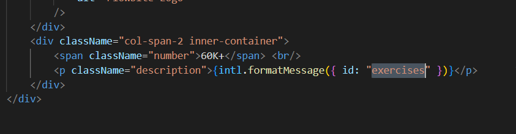
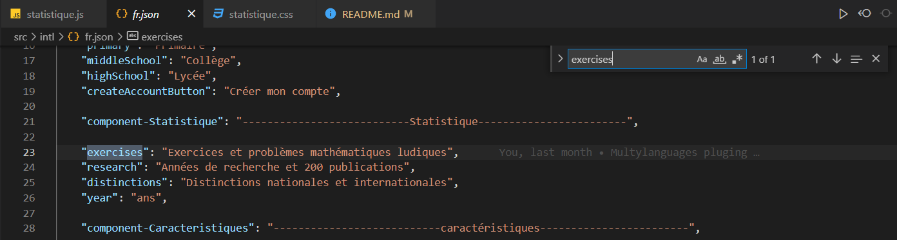

<<<<<<< HEAD


# Mathscan

> MATHSCAN est l'unique plateforme dans le monde francophone et arabophone, permettant l'identification et la remédiation aux lacunes, la lutte contre l'oubli et l'apprentissage propulsée par l’intelligence artificielle.

## Introduction

MATHSCAN offre une approche révolutionnaire pour soutenir les étudiants dans leur parcours éducatif grâce à la technologie de l'intelligence artificielle. Elle vise à identifier les lacunes des apprenants, proposer des solutions personnalisées pour y remédier, et utilise des techniques avancées pour éviter l'oubli des connaissances acquises.

## Installation

Pour démarrer avec ce projet Gatsby, assurez-vous d'avoir [Node.js](https://nodejs.org/) et npm installés sur votre machine. Suivez ensuite ces étapes :

1. **Cloner le dépôt**

    Ouvrez un terminal et exécutez :

    ```sh
    git clone https://github.com/KEBIRHAMZA/mathscan.git
    cd mathscan
    ```

2. **Installer les dépendances**

    Dans le répertoire du projet, exécutez :

    ```sh
    npm install
    ```

3. **Démarrer le projet**

    Lancez le serveur de développement Gatsby :

    ```sh
    gatsby develop
    ```

    Vous pouvez maintenant accéder à votre site en développement local à `http://localhost:8000`.

## Configuration

### Modification du contenu de l'application

Pour personnaliser ou modifier le contenu textuel de l'application selon la langue, vous Recherchez ce que vous voulez modifier en copiant l'id comme illustre l'image.



Aprés vous devez accéder aux fichiers JSON spécifiques à chaque langue. Voici les étapes à suivre pour chaque langue prise en charge par l'application :

- **Arabe** : Naviguez vers `src/intl/ar.json` pour modifier le contenu en langue arabe.
- **Français** : Pour ajuster le contenu en français, allez à `src/intl/fr.json`.
- **Anglais** : Si vous souhaitez changer le texte en anglais, visitez `src/intl/en.json`.

Une fois dans le fichier de langue approprié, vous pouvez localiser rapidement le texte spécifique à modifier en utilisant la fonction de recherche de votre éditeur de texte (généralement accessible via `Ctrl+F`).

=======


# Mathscan

> MATHSCAN est l'unique plateforme dans le monde francophone et arabophone, permettant l'identification et la remédiation aux lacunes, la lutte contre l'oubli et l'apprentissage propulsée par l’intelligence artificielle.

## Introduction

MATHSCAN offre une approche révolutionnaire pour soutenir les étudiants dans leur parcours éducatif grâce à la technologie de l'intelligence artificielle. Elle vise à identifier les lacunes des apprenants, proposer des solutions personnalisées pour y remédier, et utilise des techniques avancées pour éviter l'oubli des connaissances acquises.

## Installation

Pour démarrer avec ce projet Gatsby, assurez-vous d'avoir [Node.js](https://nodejs.org/) et npm installés sur votre machine. Suivez ensuite ces étapes :

1. **Cloner le dépôt**

    Ouvrez un terminal et exécutez :

    ```sh
    git clone https://github.com/KEBIRHAMZA/mathscan.git
    cd mathscan
    ```

2. **Installer les dépendances**

    Dans le répertoire du projet, exécutez :

    ```sh
    npm install
    ```

3. **Démarrer le projet**

    Lancez le serveur de développement Gatsby :

    ```sh
    gatsby develop
    ```

    Vous pouvez maintenant accéder à votre site en développement local à `http://localhost:8000`.

## Configuration

### Modification du contenu de l'application

Pour personnaliser ou modifier le contenu textuel de l'application selon la langue, vous Recherchez ce que vous voulez modifier en copiant l'id comme illustre l'image.


Aprés vous devez accéder aux fichiers JSON spécifiques à chaque langue. Voici les étapes à suivre pour chaque langue prise en charge par l'application :

- **Arabe** : Naviguez vers `src/intl/ar.json` pour modifier le contenu en langue arabe.
- **Français** : Pour ajuster le contenu en français, allez à `src/intl/fr.json`.
- **Anglais** : Si vous souhaitez changer le texte en anglais, visitez `src/intl/en.json`.

Une fois dans le fichier de langue approprié, vous pouvez localiser rapidement le texte spécifique à modifier en utilisant la fonction de recherche de votre éditeur de texte (généralement accessible via `Ctrl+F`).

>>>>>>> origin/KEBIR
